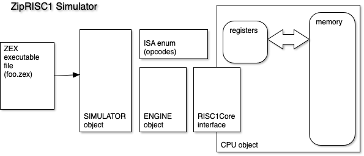
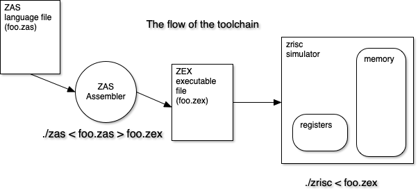

# ZipRISC1

A Java-based CPU simulation of a RISC processor.

### v1.4 notes

many of these things are coming from WeakJava
which maybe needs to be weakjava (.wj)

- make it more ARM-like
- reduce back to 16 regs
- processor state reg??
- comparator instructions
- removal of superfluous branches
- NOPE add $literal for decimal numbers on instructions
- add MOVI pseudo


## v1.3

The ZipCode RISC-1 (a 32-bit) microprocessor needs a simulator to prove to the potential investors that this is a world-beating design that Intel, AMD and Apple will all give up building cpu hardware when they see how fast and clean and _cool_ this processor is.

A CPU (central processing unit) has what's called an Instruction Set Architecture (ISA).
There are many copyrighted/proprietary ones, like ARM(Apple, RaspberryPi/Broadcom) and x86_64(Intel/AMD).
There are several "open source" ones as well like RISC-V.
There are also many, many "demonstration" or "made up" ones. This is one of those.

An ISA is a set of crafted "instructions" which are matched to a CPU design. 
A common design is a RISC (reduced instruction set computer) where the number of instructions is relatively low number, like say 20, which are all pretty 'regular' or uniform (4 bytes, 32bits) in size.
A CISC (complex instruction set computer), on the other hand, has two major aspects that RISC does not.
CISC cpus often have hundreds of instructions (x86_64 has more than 1500) and the instructions sizes vary (from 16-bit (2 bytes) to larger (up to 15 bytes)).

Now, why look at ZipRISC? Especially if it's a virtual processor?
Well, ZipRISC1 is a pretty simple microprocessor.
It also has a simple set of instructions.
And while only having a few instructions, it can do anything a CISC cpu can do (theoretically).
And because it looks like RISC is winning the long war against CISC.

It has a simple internal core architecture, and a simple set of instructions.
It is "turing-complete".
This processor is a little (very little) like the new Apple Silicon M1s, in that it has memory side-by-each with the registers (as in the memory is inside of the CPU).
Its memory is not a separate subsystem (like on an IBM PC architecture machine (which most PCs are)).

The 'von neumann architecture' (look it up) is the idea of a "stored program computer'. (Is that all?) Yes, but it accounts for the vast majority of computer architectures.
A computer runs a program that has been placed in its central memory, and then it starts at some location, interpreting each memory word as an instruction, each instruction having the cpu do something very simple; like say add two numbers.
The cpu then goes to the next word in memory, over and over, until it is told to halt.

So, a computer boils down to a CPU and some memory, and a few ancillary functions like input and output.

Dealing with computer instructions can be hard if you do it in binary.
So we don't.
We do it in this case in hexadecimal.
We also don't want to do it entirely low-level, so we invent languages where we can express our programs in a "higher level way", and then build translator programs which translate the higher level program into machine instructions.

Historically, the lowest level was a "symbolic assembler", which assembled "assembly code" into instructions. That's where this lab is focused.

You write programs in a processor's assembly language (The ZAS language), specifically for the ZipRISC1, and turn it into machine code, which you then simulate on your simulator.

You need to write a processor simulator which runs code and acts like the internals of a model processor.
It reads in a file of ZipRISC1 machine code (.zex file), loads it into memory and starts execution.
The simulation continues until either a 'Panic' (crash) or a completion of the program.
When you start the program, you execute the instruction found at memory location 0x0000.

Each memory location is a 32-bit "word" made up of 4 "bytes".
Each byte can only contain numbers from 0-255.
Memory sizes can be modified as needed.
Let's start with 64K words (or 256K bytes).



### ZipRISC1-32/16 (64K)

There are 16 registers, numbered 0 to 15 (or x0 to x1F). Registers are super-fast places inside a cpu which are used to perform specific instructions. You can

- perform arithmetic on a register
- move 32-bit words from one register to another
- perform simple input and output from/to a register
- move a word in memory to/from a register
- jump to an address based on a compare between registers

Register xPC (xF or r15) is used as the Program Counter (PC).
It contains the address of the next instruction to be executed.
Register xIR (xE of 14) is the Instruction Register.
It is the place where the current instruction is placed just before it is executed.
Register 0 (x0 or zero) is 'hardwired' to zero (which proves to be surprisingly handy).
There are also registers assigned to the stack pointer, the frame pointer, the return address, and to the parameters of a function.

The processor runs a program from 0x0000 until it told to halt (HLT).
When it is told to HALT, and no errors have occurred, you can consider your program to have "run".

This processor version has 16 registers, it is still a 32-bit cpu.

The cpu currently has NO notion of "floating point"; that is left as an exercise for the student.

So this lab/project has you implementing code for our ZipRISC1 processor.
We have provided a simple version of the main loop of the simulator which only implements HLT, BRA and ADD.
You must implement the rest of the instructions.

We have also provide a very stupid, simple "assembler" (zas) which can translate ZipRISC1 Assembly (.zas file) code file (UTF-8 text) (and human readable-ish) into the ZipRISC1 executable format (.zex) (which is a UTF-* text file the simulator's loader can load into the the processor's memory when starting up a simulation.)

The assembly file is a program file which tries to do some kind of simple task.
Each line is one of four possible layouts, and if you mess up the layout, well, you get a very simple error message.
The assembler quits as soon as it finds an error, or runs until the input runs out, and then drops the output file.
You then start the simulator on the output of the assembler and see what happens.
You may get some output, an error, or maybe even a Panic.
Panics are bad.
Panics mean something is very wrong with something you're trying to do in the assembly language code you're trying to run.

### To RECAP

- 16 registers: 32-bits wide named x0 to xF  (the x0 register is ALWAYS zero)
- memory: 0x0000 - 0xFFFF (64K 32-bit words!! (or 256Kbytes)) 
  - (this can be trivially changed)
- memory is NOT byte-addressable
- I/O: input/output (special registers)
- all instruction: 4 bytes, numbered 0, 1, 2, 3
  - opcode, operand1, operand2, operand3
- some instruction take one or two operands, some take three.

## ZipRISC1 Instructions

The first column is the “assembly code”, 2nd is the memory layout of the instruction (4 bytes), third is “meaning” in pseudo-code.

### Core Instructions

- rd is the destination register
- rs, rt are "argument" registers
- k stands for an integer constant (prepend a #) #1 #42 in DECIMAL etc...
- aa stands for an memory address, usually in hexadecimal 0x0002
- yes, rd, rt, & rs can be all the same register (or not)

#### opcodes - Instruction Set
- HLT | 0000 | halt cpu

- **Math**
- ADD rd, rs, rt | rd <- rs + rt
- ADDI rd, rs, k | rd ← rs + k
- SUB rd, rs, rt | rd <- rs - rt
- SUBI rd, rs, k | rd ← rs - k

- **Branches**
- BRZ rd, aa | branch to aa on rd == 0
- BGT rd, aa | branch to aa on rd > 0

- **Logical operators**
- LSH rd, rs, k | rd <- rs << k 
- RSH rd, rs, k | rd <- rs >> k 
- AND rd, rs, rt | rd <- rs & rt
- OR rd, rs, rt | rd <- rs | rt
- XOR rd, rs, rt | rd <- rs ^ rt

- **Load/Store memory**
- LD rd, aa | load rd with value of memory loc aa
- LDI rd, aa | load rd with address value aa
- ST rs, aa | store rd value to memory loc aa
- LDR rd, rs | load rd with contents of memory(rs)
- STR rd, rs | store rd with contents of memory(rs)

- *I/O*
- IN rd | read in a integer to rd
- OUT rd | output a integer from rd
- INB rd | read a byte from stdin
- OUTB rd | write a byte to stdout

- more branches for completeness (v1.4, not sure we need these)
- BLT  rd, aa | branch to aa if rd less than 0
- BRNZ rd, aa | branch to aa if rd NOT equal to zero
- BLE rd, aa | branch to aa if rd less than or equal to zero

#### Need to Implement these Comparators! (v1.4)

- **Comparators**
- CMEQ rd, rs, rt | rd <- 1 if rs == rt, 0 otherwise
- CMNE rd, rs, rt | rd <- 1 if rs != rt, 0 otherwise
- CMLT rd, rs, rt | rd <- 1 if rs < rt, 0 otherwise
- CMGE rd, rs, rt | rd <- 1 if rs >= rt, 0 otherwise

- **Misc**
- DUMP | print out registers, machine state and memory
- HCF | halt and catch fire.

### Pseudo Instructions

These are just handy, the text in the first column gets translated to the instruction in the second column.
While they are not actual cpu instructions, the assembler can take the pseudo-instruction and transform it into a "real" cpu instruction(s).
Some programmers will benefit from having these pseudo-instructions because they make the assembly code more readable.

- MOV rd, rs │ ADD rd, rs, x0 │ rd ← rs
- MOVI rd, k | ADDI rd, rd, k | rd <- k
- CLR rd │ ADD rd, x0, x0 │ rd ← 0 + 0
- DEC rd │ SUBI rd, rd, 1 │ rd ← rd - 1
- INCR rd | ADDI rd, rd, 1  | rd <- rd + 1
- BRA aa │ BRZ x0, aa │ branch to aa, when register zero equals 0
  - (yes x0 is ALWAYS 0) (so think GOTO aa)
- CMLE rd, rs, rt | CMGE rd, rt, rs (note: rt & rs swapped)
- CMGR rd, rs, rt | CMLT rd, rt, rs (note: rt & rs swapped)


#### the calling convention for subroutines/functions.

- CALL aa | ADDI x1 xPC 1; BRA aa | ra <- PC + 1, jump to aa
- RET | ADD xPC x1 x0 | pc <- ra (ra is "return address")
- PUSH rd
- POP rd

### Assembler Directives

Directives included help layout code in the memory. They are kind of like macros.

.OR set origin address of code (load code starting at this address (hex)

```
.OR 0x0000
```

.WD load next memory word with decimal number

```
.WD 2
```

.EQ equate for defining decimal constants

```
.EQ Zero 0
.EQ OneHundred 100
```

(but I am not sure we need this yet. nor whether the assembler will resolve the symbol correctly. needs to be debugged.)

### not yet implemented

These are left as an exercise.

.HS hex string of bytes

```
.HS '001234AFDCE'
```

.AS ascii string of bytes - any delimiter except white space - whatever started it ended it

```
.AS ‘This is a string.’
```

.BS n reserve block storage of n (decimal) bytes

```
.BS 64
```

.EQ equate for defining decimal constants

```
.EQ Zero 0
.EQ OneHundred 100
```

### Labels

labels are like a text anchor or target in assembler source code. 
When labels are used they do one of two things (currently).
The first is that they come to represent the address of the next instruction.

```
    LD x2, 0x00FF // memory location 255 
label1:
    BRZ x2, end
// bunch of code
end:
    HLT
```

So when the assembler is finished, `label1` and `end` will both be resolved to a specific address, but we don't know what it will be be because we don't how much code is between the two labels.
The assembler will figure it all out and create code so that the labels point to a valid memory address.
We also see the second use of labels on the `BRZ` line: if register x2 is zero, jump to `end`
So labels can be used to delay figuring out what the address of the HLT instruction is, until we've assembled the entire program.

Labels can also be used like junior variables.

```
// bunch of code
maxspeed:
.WD 55
fueltanklevel:
.WD 2  // 0-4 (empty, 1/4, 2/4 3/4, 4/4)
// more code
```

Here we are using the label to stand in for a variable's name.
The assembler will load the number into a memory word.
Once all the code has been assembled, the label will come to point to the address of the WD directive.


### Sample Programs

#### Add 2 plus 2

```
.OR 0x0000 // start at address zero
    BRA start
two:
.WD 2
start:
    LD x1, two
    LD x2, two
    ADD x1, x1, x2
    DUMP
    HLT
```

The output from zas of this file would be a UTF-8 file of hex numbers.

```
0x0000 05 00 00 02 // BRA start
0x0001 00 00 00 02 // two = 2 store a constant (two is 0x0001)
0x0002 0C 01 00 01 // LD x1, two
0x0003 0C 02 00 01 // LD x2, two
0x0004 01 01 01 02 // ADD x1 x1 x2
0x0005 0F 00 00 00 // DUMP
0x0006 00 00 00 00 // HALT
```


#### Get two numbers and print their sum.

```
loop:
    IN x1
    BRZ x1, exit
    IN x2
    ADD x1, x2
    OUT x1
    BRA loop
exit:
    HALT
```


read in a number and double it

```
loop:
    IN x1
    ADD x1, x1
    OUT x1
    BRA loop
```

multiply by 8, value at aa 90

```
loop:
    IN x1
    ADD x1, x1
    ADD x1, x1
    ADD x1, x1
    OUT x1
    BRA loop
```

Max function (read two inputs, output the larger of the two)

```
loop:
    IN x1
    IN x2
    SUB x1, x1, x2 // x1 <- x1 - x2
    BGT x1, first // if x1 > 0 goto first:
second:
    ST x2, 91
    BRA loop
first:
    OUT x1
    BRA loop
```

Build me a Guess the Number program?

## Toolchain



### ZAS Assembler

`zas` translates a .zas file on standard input to standard out (which you should put into a .zex file).
Debugging information gets dumped to standard error.

A ZAS assembler file is a text file which contain the lines of a program which runs on the ZipRISC1.

File format is simple: a line is either empty, a directive, a label, or an instruction

On any line, anything after a `//` is a comment. 
For readability, directives and labels should start at `^` (beginning of line) and Instruction lines should start with `^\t` (leading tab).

```
start:
    HLT // stop the machine. exit status is zero.
```

### Loader/Evaluator

The a microcode evaluator has several parts:

- CPU class - a very simple POJO that handles memory and registers and cpu status.
- Engine class - where all the processor implementation code goes
- Simulator class - which executes the simulation
- Word class - the model for the memory locations.
  - note that the memory is only word-based (32bit quantities), NOT byte addressable
  - this *may* make **Strings** had to implement? or no?

load a .zas file into memory and start execution at 0x0000.
A common thing to do is to load 0x0000 with a `BRA aa` which allows for data to be loaded into low memory locations. `aa` would be a label like "start" or "main" where the actual code is.

The Simulator then essentially does this: (remember, PC is the Program Counter, the IR is the instruction register)

```
cpuRunning = true
PC = 0 // 0x0000
while (cpuRunning == true) {
    IR = memory[PC] //load IR with contents of Memory[PC]
    PC += 1
    decodeAndExecute(IR) //Decode and Execute instruction in IR
    // the HLT instruction sets cpuRunning = false
}
// dump the cpu and memory final state
```

```
./zrisc < testzas/firstprogram.zex
```
You should be able to run the `firstprogram.zex` file with the simulator as input without making any changes.
It only uses HALT, ADD (doing nothing) and BRA (unconditional branch or jump).
Look at both `firstprogram.zas` for the assembly source code and `firstprogram.zex` (the machine code) to see what these files look like.
Then, finish up all the instructions in the Engine class, and write some test zas files, run the assembler on them, and then run the zex files to test your instructions.
You'll need to learn the assembly language format and what the instructions are supposed to do.

Then, think about these ideas...

### Ideas to ponder

- how would you multiply two integers?
- How would you make an If statement?
- How about If/Else?
- And loops?
  - while loop
  - For loop
- How about a simple function performing an arithmetic equation?
  - x = x + y - z
  - x = 2 * x - y + z
- How would you implement a simple string?
- What needs to change for string I/O?
- Should the I/O pattern be changed to ONLY UTF-8 in an out?
- How would you parse an integer from a string of bytes in zas?
- How could you implement memory-mapped IO in the engine?

### Stuff in side of CPU

Main Processor Data Structures

- status (1 word)(flags??)
- registers (32 words)
- memory (16384 words)
- input word
- output word
- integer stack for arithmetic stuff (8 words)

You get to graduate from ZipCode early if you write a C compiler for this processor.
Several corporate partners may actually compete to hire you for bigger than normal money if you manage that.

### Not Quite Implemented

There is an integer stack (8 words) inside the cpu.
It could be used to simplify math within registers.

### Futures to be Added

- (maybe even PUSHI and POPI? immediate versions of Push/Pop
- strings - handle unicode arrays in memory

- implement a WeakJava compiler as example.
- implement a femtoC compiler
- implement a femtoLisp interpreter
- implement a Forth

(femto- here means very very small, probably useless, like WeakJava is)

_Need a BUNCH of tests!_

the diagrams are sourced via http://shapesapp.com and are in the WeakJava repo.